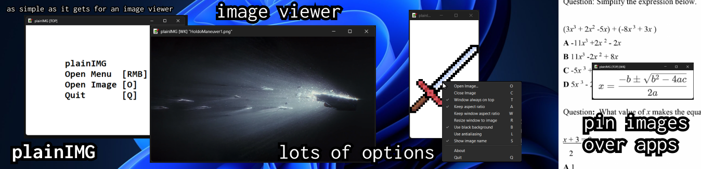
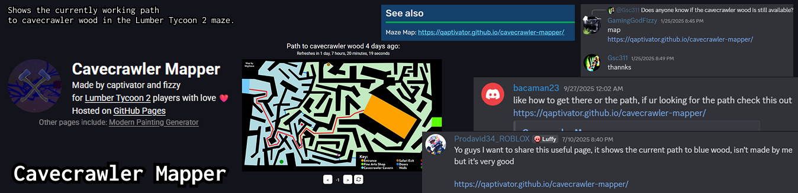
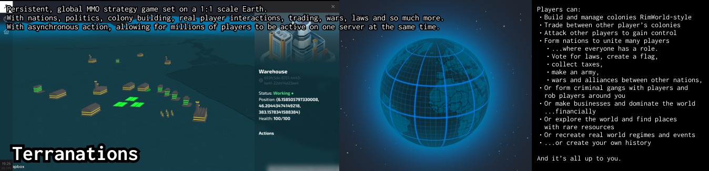
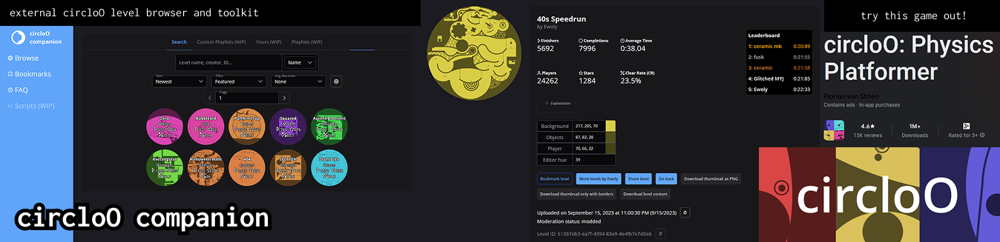

# hi

my name is captivator, i am a developer with 4 years of experience in frontend, but i like experimenting too. ♂️ (he/him)

languages i know very well and adore: vue (nuxt), tailwindcss, javascript/typescript, blender (the 3d making one), C#, moleculer (microservices, still learning), nuxt ui.

other languages i coded in: python, lua/luau (roblox studio), C, java (ugh), discord.js, primevue and shadcn-vue, bf, cpu assembly in minecraft redstone(?) and logisim, capacitorjs.

languages i would love to try and later learn: svelte, rust, ruby, solidity.

<!-- align="middle" https://stackoverflow.com/questions/24319505/how-can-one-display-images-side-by-side-in-a-github-readme-md -->

  
  
  
  <!--  -->
  

# projects i made

[**plainimg2**](https://github.com/qaptivator/plainimg2) -- simple but gets-the-job-done image viewer which is very lightweight, images take up your entire screen AND you can use this to pin/place images over your screen! **(personally, i use this every single day)**

---

[**cavecrawler-mapper**](https://qaptivator.github.io/cavecrawler-mapper/) -- shows the current path to cavecrawler wood through the tropics maze in the roblox game Lumber Tycoon 2, a Roblox game. *likely my most viral project yet because many people in the LT2 Wiki use it.* my friend Fizzy helped make all the map variations (credits to WigSteve for the maze map)

---

**Convenotes (WIP)** -- drop in your content, ask anything, and get clean, usable outputs fast. as well as a very flexible knowledge base, fitting for many types of people. my ai saas i have been working on for over a year. WORK IN PROGRESS. this is my greatest project so far and i want to finish it at least by end of 2025. it will also serve for a lot of audiences so i can't describe it in full detail.

main pitch i am using for the main audience: *Turn your meetings into clear, actionable tasks.* 

target audiences

  
- entrepreneurs, startup founders, remote workers (record meetings, get tasks and summarizations)
- dropshippers, e-commerce people (copy product info from one shop to your shop, with a browser extension, keep track of all your product info)
- students, learners (record lectures, or upload youtube videos and other material, then ask questions and summarize into flashcards or mindmaps)
- power users, tech-savvy people like programmers (general knowledge base, keep track of every day life, store information and later retrieve with ai, organize things with tags and folders, flexibility)

---

**Terranations (WIP)** -- persistent, global MMO strategy game set on a 1:1 scale Earth.
with nations, politics, colony building, real player interactions, trading, wars, laws and so much more.
with asynchronous action, allowing for millions of players to be active on one server at the same time.

this is my dream  game, it is and will be in development for a long time, and it will be my most grand project ever...

---

[**circloo-companion**](https://qaptivator.github.io/circloo-companion/) -- *circloO, what a great game. it took several years off my life-* anyway so this is a level browser for a small indie game on google play called circloO. it's a 2d platformer game where you roll around with a circle (you have only two inputs: go right or left). there is also a level editor, so people can upload their levels. after hacking around with the desktop version of this game on steam, i found the endpoints to fetch levels from and made this awesome tool.

---

- **smsg** -- sms api gateway android app which is used to recieve sms on your phone's sim, and send it over to your server, basically bypassing all the sms provider fluff like Twillio. allows for two way communication too using a message queue and polling. this app is also used by at least **2 businesses**. the code is kept private for now, and i don't plan on uploading this to google play due to strict rules.
- [**domain-stuff**](https://qaptivator.github.io/domain-stuff/) -- my personal website where i put many useful tools. started as a fast domain availability checker, it grew into just me putting there whatever seems useful enough but most websites which have this are laggy, old and have many ads. no ads here! i thought about putting a blog there too and turning it into my own personal website, but i will buy a different domain for that... and make it look unique or something.

(as you can see, most of these projects are purely utilitarian. i struggle at making fun things)

less important but still worth mentioning projects:
- [**jtoh-xl-tower-tracker**](https://qaptivator.github.io/jtoh-xl-tower-tracker/) -- i also played a LOT of roblox advanced obbies, especially EToH, and this is similar to circloo companion but instead it tracks your progress in an obbying fangame. uses the roblox api to query your badges and display them nicely (all the towers there were entered by hand, not scraped). this project is pretty much scrapped just because a better alternative appeared which did exactly this but to all other fangames, which makes this website useless.
- [TrainStatusIcons](https://github.com/qaptivator/TrainStatusIcons) -- ***Factorio mod*** which adds the train status icons mentioned in the FFF blog, with ***5.5k downloads***. this is also scrapped just because Factorio 2.0, adding this feature anyway, released just a month later, so this is maybe only ever useful for people who play older Factorio for some reason. i'm still proud of this project though, it got many downloads from the mod page (5.5k!), and it was a nice time sharing this.
- [everyexport](https://modrinth.com/mod/everyexport) -- simple fabric minecraft mod to export all item and recipe data from the game. useful if you're an advanced tech player in mc, i guess. here, i also trained my java/kotlin knowledge.
- [circloO-patcher](https://github.com/DT-is-not-available/circloO-patcher) -- modding tool for aforementioned circloO. this wasn't started by me but by *DT*. i helped out in some parts and tried polishing it up to a modest modding framework: it kind of worked but it was very uncomfortable to use. now it's pretty much scrapped because DT moved on from circloO (and i also did that), and doing modding for such a small game where only ~5 people ever cared about it is just pointless.

*i also like cooking food*

# projects i am currently working on

- untitled social game -- a grand strategy game on 1:1 earth all about making countries, building bases and so on. i won't reveal much but it's gonna be great. but at the other hand, it will take a few years off my life, so this is my magnum opus, my grand goal.
- untitled ai saas -- currently work in progress for almost a year (most of that time spent to figure out what i truly want to make), but this *should* be my first successful product launch.

# things im currently learning

1. backend
2. marketing/entrepreneurship
3. sociability

# history

starting as a child, i learned construct. i scratched the surface of scratch but didn't go far there. after some time in construct i moved on to UNITY. after around a year of courses, i maybe made 2-3 untitled games. many were unfinished though. then i attempted hosting minecraft servers, then i finally got to frontend. started with vue (nuxt) just because it seemed the most comfortable. after years of practice and countless projects, im *starting* to learn backend.

fun fact: i used q in my username instead of c because the username with c was taken. sometimes i also use "captivater" if "captivator" is taken.

# how to reach me

on X/Twitter, @andreiatdev

on Discord, `[REDACTED]`

on email, `[REDACTED]` (TODO: provide one in case i ever do professional work)

ALL LOWERCASE!!!

<!--
**qaptivator/qaptivator** is a ✨ _special_ ✨ repository because its `README.md` (this file) appears on your GitHub profile.

Here are some ideas to get you started:

- 🔭 I’m currently working on ...
- 🌱 I’m currently learning ...
- 👯 I’m looking to collaborate on ...
- 🤔 I’m looking for help with ...
- 💬 Ask me about ...
- 📫 How to reach me: ...
- 😄 Pronouns: ...
- ⚡ Fun fact: ...
-->
